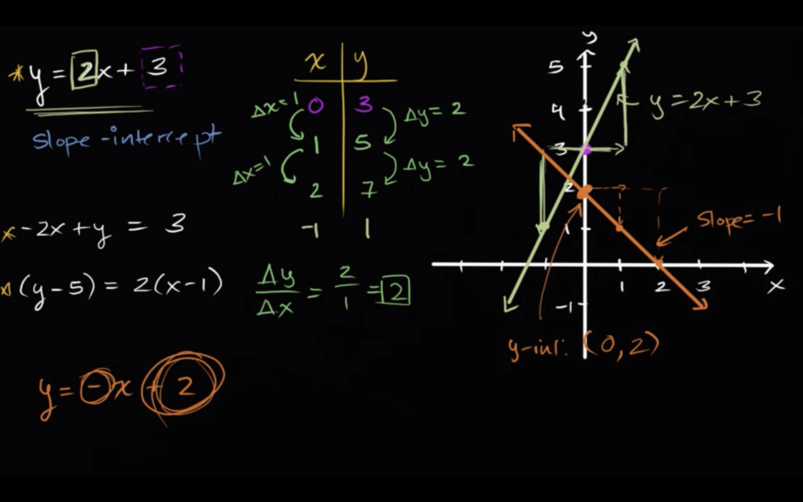

# [Intro to slope-intercept form](https://www.khanacademy.org/math/algebra/x2f8bb11595b61c86:forms-of-linear-equations/x2f8bb11595b61c86:intro-to-slope-intercept-form/v/slope-intercept-form)

## y = 2x + 3

So the **slope here, our change in y over change in x**, if we're going from between any two points on this line, is always going to be two.

But where do you see two in this original equation?
Well you see the two right over here.

And when you write something in slop-intercept form, where you explicitly solve for y, y is equal to some constant times x to the first power plus some other constant, **the second one is going to be your intercept**, your y-intercept, or it's going to be a way to figure out the y-intercept, the intercept itself is this point, the point at which the line intercepts the y axis, and then this two is going to represent your slope.

And that makes sense because every time you increase x by one, you're gonna multiply that by two, so you're gonna increase y by two.

## y = -x + 2

If you were given another linear equation, let's say **y is equal to negative x, negative x plus two**.

Well immediately you say, okay look, my y intercept is going to be the point zero comma two, so I'm gonna intersect the y axis right at that point, and then I have a slope of, the coefficient here is really just negative one, so I have a **slope of negative one**.

So as we increase x by one, we're gonna decrease y by one. Increase x by one, you're gonna decrease y by one. If you increase x by two, you're gonna decrease y by two.

So from slope-intercept form, very easy to figure out what the y-intercept is, and very easy to figure out the slope. The slope here, slope here is negative one. That's this negative one right over here, and the y-intercept, y-intercept is the point zero comma two, very easy to figure out 'cus essentially that gave you the information right there.
