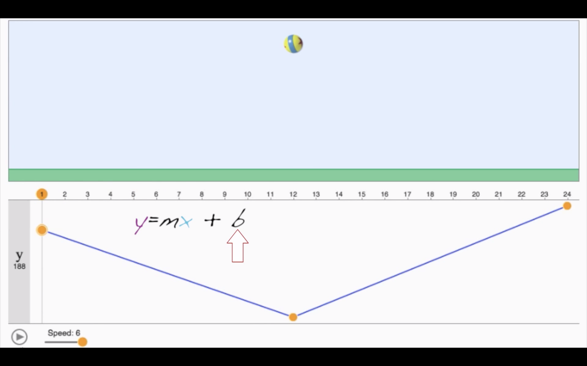

# [Introduction to animation](https://www.khanacademy.org/partner-content/pixar/animate/ball/a/start-here-animation)

## [Math meets artistry](https://www.khanacademy.org/partner-content/pixar/animate/ball/v/intro-animation)

### Key poses and in-betweens

All animation is based on the same idea.
Making changes to a series of images and playing those images back in sequence.

Now in hand-drawn animation, we do this by drawing.
Animators draw **key poses** and then draw a series of pictures we call **in-betweens** that connect the motion from one pose to another.
It's a lot of drawing.

In computer animation, we animate by moving virtual digital models.
We call this **posing**.
The poses we create are translated into coordinates that are recorded on a spreadsheet.
The computer fills in the **in-between images**.
These **in-betweens** are the result of a computer interpreting what motion would move an image from this pose to that pose.

### Splines

And there are many different ways of filling in the **in-betweens**.
But each can be described using a mathematical function called a **spline**.

The simplest way to see this spline idea is through a bouncing ball.
I'm going to make it bounce from here to here with four main poses that I define by setting **keyframes**.
The computer draws all the other frames by evaluating the **splines**.
By default, the computer makes a **linear interpolation** of the motion and we get something that moves at a constant speed.

Now from physics we know that the ball should accelerate on the way down and decelerate on the way up.
I can adjust the shape of the **spline** to change the **timing**.

As an animator, it's my job to bring to life a specific character.
So I need to ask myself some questions.

- Is the ball heavy and depressed like this?
- Or maybe it's happy.
- Maybe it's a balloon.

Once I answer these questions, I can choose what kind of **spline** I think will have that effect in the motion.

And this gets even more exciting when you're looking at a character and their physics because *how a character moves says a lot about who they are*.

### Example

For example, Mr. Incredible in this scene, the animation needs to show him lifting up a train car.
Now, in animation, you can make that seem really quick and easy, but the director didn't want that.
He wanted the audience to know that Mr. Incredible could do amazing things but that it took a lot of effort to do them.
So, the way we define the speed of the **in-betweens** will make the difference between the train looking light or the train looking heavy.

The computer helps us a lot, but ultimately this job is really about acting.
But instead of being in front of a camera, you're taking the performance and breaking it down into tiny little 24th of a second increments, and expressing those in an abstract mathematical function.

## [Straight ahead animation](https://www.khanacademy.org/partner-content/pixar/animate/ball/v/animation-1a)

Let's first animate a ball using a technique called **straight ahead animation**.

- I'm gonna start with frame one.
- Now we'll put down another sheet of paper.
These pegs help us keep it lined up.
And I'll draw frame two here.
- Now frame three and frame four.
As you can see, I'm drawing one frame after another in order.
- When I'm done, I'll scan all of these pictures into the computer so we can play it back.

[>>> Straight ahead animation works the same way in the computer. <<<](https://www.khanacademy.org/partner-content/pixar/animate/ball/pi/straight-ahead-animation)

## [Linear interpolation](https://www.khanacademy.org/partner-content/pixar/animate/ball/v/a2-quick)

**Straight-ahead animation** works, but a lot of times it's hard to figure out where you're going.
A lot of times, it's helpful to start by working out what we call the **key poses first**.

For a bouncing ball, that's gonna be where the ball is at its highest point and where it hits the ground.

- I'll start by drawing frame one up high.
- Now let's draw frame nine on the ground.
- Now I can draw the **in-betweens** using these **key poses** as a guide.
- I'll draw frame five in the middle. We call this a **breakdown**.
- Now I can keep adding more frames, subdividing the space.

Sometimes it helps to make a little chart to keep track of all the numbers.


Animators have developed a visual language using these **timing charts** to show how to space the drawing in between **key poses**.

[>>> Now let's see how we use the same technique of pose-to-pose animation on the computer. <<<](https://www.khanacademy.org/partner-content/pixar/animate/ball/pi/animation-with-linear-interpolation)

This is called linear interpolation.

## [Bezier curves](https://www.khanacademy.org/partner-content/pixar/animate/ball/v/animation3)

You probably noticed that in order to get smooth motion, you ended up having to pose the ball in pretty much every frame.
The computer's helping, but it's still a lot of work to get something that looks smooth.
Instead of **linear interpolation**, we can use something called **Bézier curves**.

If you've ever used design or drawing software, you've probably used **Bézier curves** without even knowing it.
This is named after a French engineer, Pierre Bézier, who invented this method to describe the **smooth curves** needed when designing cars.
These kinds of functions made up of **Bézier curves** are called **splines**.

**Bézier curves** come with these handles that let us control the shape of the graph between our **key poses**.
We get this nice curve that eases out of the first pose, and ramps down to the second one.
If you look at how these values map, you can see something that looks just like our **timing chart**.

[>>> Now you try it out. <<<](https://www.khanacademy.org/partner-content/pixar/animate/ball/pi/animation-with-bezier-curves)

You should be able to get much smoother motion using **Bézier curves**.

## [Squash and stretch](https://www.khanacademy.org/partner-content/pixar/animate/ball/v/animate-4)

We'll start by adding another control.
At Pixar we call these **"animation variables"** or **"avars"** for short.
This **avar** scales the ball out in X, and down in Y.
You can control the **timing** of this **avar** using the same graph editor.
Now we can make the ball stretch on the way down, and squash when it hits the ground.

This idea of squash and stretch is one of the key principles of animation.
Animating the squash and stretch of an object helps us to communicate *what that material is made out of*.
Remember, our job as animators isn't just to move things around, it's to bring them to life.
And one way to do that is to show the character's thought process.

[>>> Squash and stretch animation with Bezier curves <<<](https://www.khanacademy.org/partner-content/pixar/animate/ball/pi/squash-and-stretch-animation-with-bezier-curves)

## [Practice: Animation 101](https://www.khanacademy.org/partner-content/pixar/animate/ball/e/animation-101)

**Timing chart** for the **avar** controlling the y coordinate of a ball:


- x-axis represent time in frames;
- y-axis represent the height of the ball above the ground.

### Linear interpolation

**Timing chart** for the y **avar** for a ball:


### Bezier interpolation


## [Save your animation](https://www.khanacademy.org/partner-content/pixar/animate/ball/a/save-your-animation)

[>>> Program to build animation. <<<](https://www.khanacademy.org/partner-content/pixar/animate/ball/a/save-your-animation)

## [Hands-on activity: animating Luxo Jr.](https://www.khanacademy.org/partner-content/pixar/animate/ball/a/hands-on-activity-animating-luxo-jr)

The director has a very specific request.
She needs a 20 frame animation of a ball which drops straight down from the sky and bounces twice on ground.
This time, you should draw using **pose-to-pose animation**.
This means you’ll need to identify the **key poses** first, and then worry about the **in-between frames**.

1) Number the corner of each frame from 1-20:

- 1 on the bottom page,
- 2 on the next page,
- etc.


2) Sketch a **timing chart** to plan the motion over 20 frames.


3) Think about all the **key poses** needed for your animation.
**Key poses** are the most important events in the **timing sequence**, such as when the ball hits the ground or is high in the air.


# [Mathematics of animation curves](https://www.khanacademy.org/partner-content/pixar/animate/parametric-curves/a/lesson-brief-animation)

## [Mathematics of linear interpolation](https://www.khanacademy.org/partner-content/pixar/animate/parametric-curves/v/animation-5)

Two ways to calculate **in-betweens**:

- linear interpolation and
- Bézier curves.

We're gonna build on some of what we learned in the [>>> environment modeling lesson <<<](https://www.khanacademy.org/v/overview-parabolic-arcs).

Let's start with the simpler version, **linear interpolation**.
Let's focus on this **segment**.


We know the value of y at frame 4 is 750 and the value at frame 8 is 190, but what's the value of y at frame 5, 6, or 7?

The picture tells us that y can be represented as a linear function of x, where x is the frame number.



Linear functions can be written in [>>> slope-intercept form <<<](https://www.khanacademy.org/math/algebra/two-var-linear-equations-and-intro-to-functions/slope-intercept-form/v/slope-intercept-form): **y = mx + b**, where m is the slope and b is the y-intercept.
Now we don't know the slope and intercept directly, but we do have *two points on the line, which is enough information to calculate them*.
Now, once we have m and b, we can figure out y for any frame.

## [Practice: Linear interpolation](https://www.khanacademy.org/partner-content/pixar/animate/parametric-curves/e/linear-interpolation)

### Practice 1

The value of an **avar** controlling the y-coordinate of a ball is 400 in frame 14, and 220 in frame 20.
The y-coordinate of the ball between those frames is determined by linear interpolation.

The value of the ball's y-coordinate in frame 19?

```
220 + (400-220/20-14) = 250
```

### Practice 2

The value of an **avar** controlling the x-coordinate of a ball is 100 in frame 11, and 65 in frame 18.
The x-coordinate of the ball between those frames is determined by **linear interpolation**.


What is the value of the ball's x-coordinate in frame 14?

```
100 + 3 * ( (65 - 100) / (18 - 11) ) = 85
```

### Practice 3

The value of an **avar** controlling the x-coordinate of a ball is 37 in frame 6, and 37 in frame 15.
The x-coordinate of the ball between those frames is determined by **linear interpolation**.

What is the value of the ball's x-coordinate in frame 11?

```
37
```

## [Repeated linear interpolation](https://www.khanacademy.org/partner-content/pixar/animate/parametric-curves/v/a6-final)

## [De Casteljau's algorithm](https://www.khanacademy.org/partner-content/pixar/animate/parametric-curves/v/animation7)

[Constructing curves using repeated linear interpolation](https://www.khanacademy.org/partner-content/pixar/animate/parametric-curves/pi/constructing-curves-using-repeated-linear-interpolation)

## [What degree are these curves?](https://www.khanacademy.org/partner-content/pixar/animate/parametric-curves/v/animation-8)

## [Equations from de Casteljau's algorithm](https://www.khanacademy.org/partner-content/pixar/animate/parametric-curves/a/equations-from-de-casteljaus-algorithm)
